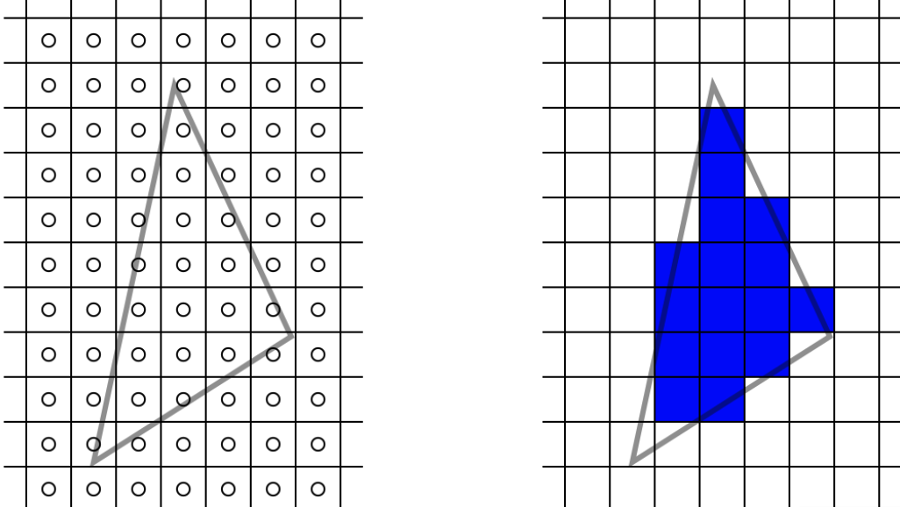
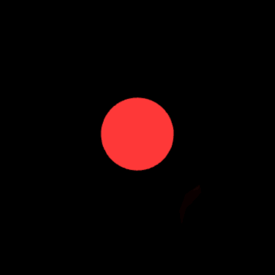
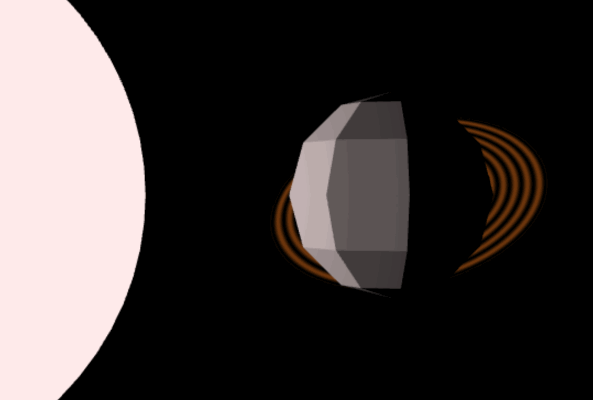
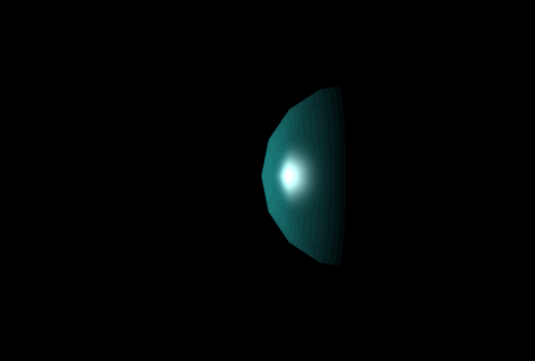
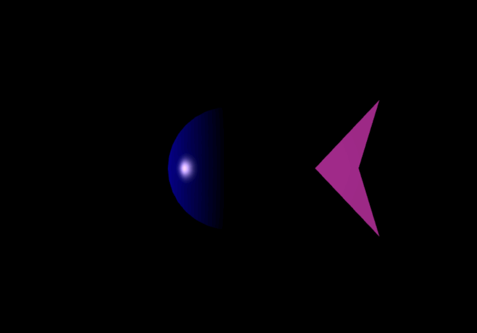
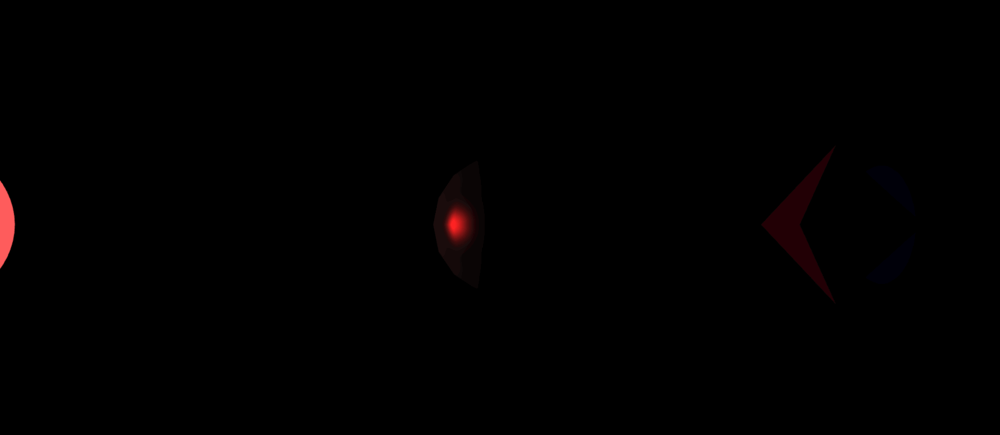

# Assignment 3: Advanced Shader and Planetary Animation

In this assignment, you will expand your understanding of Three.js by working with custom shaders and creating a dynamic planetary system. You will apply advanced techniques for handling lighting and materials using both **Gouraud** and **Phong** shading models. The animation will involve planets with varying properties and interactive user input to manipulate camera views and object behavior.


## Goals

1. **Understand Shading Models in Three.js**  
   Grasp the inner workings of **Gouraud** and **Phong** shading models and how to implement them using custom shaders in Three.js.

2. **Create Custom Shaders and Materials in GLSL**  
   Write custom vertex and fragment shaders using GLSL (OpenGL Shading Language) to implement the desired shading effects.

3. **Animate Objects Using Transformation Matrices**  
   Apply translation, rotation, and scaling matrices to animate objects in 3D space over time.

4. **Implement User Interaction via Keyboard Controls**  
   Allow users to interact with the scene by attaching the camera to different planets and toggling between shading models.

---


## Introduction to vertex shader, fragment shader and rasterization.

This introductory section is meant to provide a high-level overview of the concepts of a vertex shader, fragment shader and rasterization. We will sacrifice some technical rigor for simplicity and ease of understanding, but this simplified mental model should suffice for the assignments in this course. Also, you will not have to implement almost any of the following concepts covered, but it is very important to understand what is going on "under the hood" to complete your assignments.

A vertex is a point in 3D space. A fragment can simply be thought of as a pixel on your screen, or in other words, a square on a 2D grid that lays on the image plane. Vertices can be located at any position of the 3D space (continuous positions) while fragments are located in certain positions given by a 2D grid, since the screen is a fixed grid of pixels with fixed locations and sizes.
For simplicity, let's assume we have a single triangle in our scene. A single 3D triangle is our starting point. Our end goal is to render this triangle on the screen.
A 3D triangle is formed by 3 3D vertices. Each triangle intially lies in a continous 3D space and will need two main steps in order to be rendered with pixels located on fixed (discrete) positions. First, the triangle will be projected onto the screen plane with some projection matrix. After this step, we can now think of our triangle as a 2D triangle, since it was projected to the image plane. These vertices can still be contiuous poins of space, but they now lay on a 2D plane, the screen plane. The second step is rasterization. Rasterizing is the process of converting the continuous triangles into a some approximation of a triangle formed by many squares (pixels/fragments). In the following image you can see the process of rasterization, where we have a 2D "continuous" triangle which is rasterized into a set of discrete pixels (right-most image).



The process of rasterization involves two main steps, or answering two questions: 1: "*which* pixels should we color in order to represent the triangle?", and 2: "*what color* should we color each pixel that is covered by that triangle?".
The answer to the first question would be, in our case, a list of 16 fragment positions, as we observe 16 pixels are covered by this triangle. Perhaps the second question seems absurdly simple to answer: "we should color the pixels with the color of the triangle". However, in reality, triangles can have different colors at each vertex, and the color of a pixel that is covered by a triangle is not always simply the color of the triangle. The color of a pixel is determined by interpolating the colors of the vertices that form the triangle.

Generally, we should assume that the 3 vertices of a triangle have different properties, such as different color. Let's assume that we have defined a triangle such that two vertices are white and one vertex is black. Now the intermetiade colors are not going to be so trivial to compute as in a fully blue triangle. We would like the triangle to have a kind of gradient of shades of gray that smoothly go from white in the two white vertices to black in the black vertex. To achieve this, we will use barycentric interpolation. You can see barycentric interpolation as a way to obtain the color of any point inside a triangle, given the color of the three vertices, their respective positions and the position of the point that we are trying to compute the color for. Intuitively, the closer the point is to a vertex, the more the color of that vertex will contribute to the final color of that point. 
Now let's assume we already done step 1 of rasterization: we already know which pixels are covered by the triangle. Now, in order to answer "which color should we color each pixel", we will go throgh all pixels that are covered by the triangle.
For each pixel, we know its position in space. Now we can use barycentric interpolation to compute the color of that pixel, given its position and the colors of the three vertices.

### Vertex shader. 
The vertex shader is a program (think about it as a function) that is executed on each vertex of a triangle. This will be our first step of the pipeline. One of the tasks of the vertex shader is to transform the 3D continuous vertices into projected points onto the image 2D plane. Typically, this step within the vertex shader will look somewhat like this: 
```javascript
gl_Position = projection_camera_model_transform * vec4(position, 1.0);
```
This step is typically going to be exactly the same in most vertex shaders. `position` is the vertex position in object space (3D space), `vec4(position, 1.0)` is converting to homogeneous coordinates. `projection_camera_model_transform` is a matrix that is obtained by combining multiple transformations, from object space to projection space. When multiplying this combined transformation matrix by `position`, we are projecting the point from object space into screen space and storing the result to `gl_Position`.
 `gl_Position` is a special variable that is used to specify the position of the vertex after it has been transformed by the model, view and projection matrices.
 
 The vertex shader can also have other tasks. Let's go back to the example where we have a triangle with 3 vertices with different colors. We want to "interpolate" these colors into each of the intermediate fragments. Luckily, our graphics engine will take care of all of this. All we need to do is "tell the engine that we need to interpolate the color". Assuming that our vertex color is stored in a variable called `vertex_color`, we can tell the graphics engine to interpolate the color by adding the following line to our vertex shader:
```javascript
varying vec3 interpolate_color;
void main() {
    interpolate_color = vertex_color;
}
```
The name of the variable `interpolate_color` is not important. What matters is we used the keyword `varying` before the type (`vec3`). This tells the graphics engine that we want to interpolate the value of this variable. The graphics engine will automatically interpolate the value of `interpolate_color` for each fragment that is covered by the triangle. The interpolated value will then be available in the fragment shader.

The next part we will have to implement is the fragment shader. However, a lot will have happened under the hood before the fragment shader is actually run. After the vertex shader and before the fragment shader, the graphics engine will 1) determine which pixels are covered by each triangle and 2) perform barycentric interpolation to all variables that were marked as `varying` in the vertex shader. The interpolated values will be available in the fragment shader.

### Fragment shader
The fragment shader is a program that is executed on each fragment (pixel) that is covered by a triangle. The fragment shader will receive the interpolated values from the vertex shader and will be responsible for determining the final color of each pixel.
In our simple example, the fragment shader will look like this:
```javascript
varying vec3 interpolated_color;
void main() {
    gl_FragColor = vec4(interpolated_color, 1.0);
}
```
Note that we are definying the same variable `varying vec3 interpolated_color` that we defined in the vertex shader. This is how the fragment shader receives the interpolated values from the vertex shader. You need to make sure that the type and name of the varible is the same as you defined it in the vertex shader.
`gl_FragColor` is a special variable that is used to specify the color of the fragment.


### An example: Phong shading
The Phong shading is characterized by the fact that the color is computed per fragment (pixel). This means that in the Phong shading, we will interpolate the properties that affect the color and compute the color at each fragment. You will learn the detail of how this color is computed, but for now think about it as some function that takes into account the material propertes, the light direction, the surface direcetion, the eye (view) direction to output a color. 
Let's define the vertex shader:
```javascript
varying vec3 interpolated_normal;
varying vec3 interpolated_position;

// Let's define a function that computes the normal and position per vertex
void main() { 
    // Transform the vertex position
    gl_Position = projection_camera_model_transform * vec4(position, 1.0);

    // Pass the normal and position to the fragment shader for interpolation
    interpolated_normal = normalize((model_transform * vec4(normal, 0.0)).xyz);
    interpolated_position = (model_transform * vec4(position, 1.0)).xyz;
}
```
Here, we are computing the transformed normal and position at each vertex and passing them as `varying` variables so they can be interpolated across the surface of the triangle.

Now, in the fragment shader, we compute the final color per pixel:

```javascript
varying vec3 interpolated_normal;
varying vec3 interpolated_position;

// Let's define a function that computes the color of a fragment
vec4 compute_color(vec3 normal, vec3 position, some_parameters) {
    // Compute color based on interpolated parameters
    return color;
}

void main() {
    vec3 normal = normalize(interpolated_normal);
    vec3 position = interpolated_position;
    
    vec4 color = compute_color(normal, position, some_parameters);
    
    gl_FragColor = color;
}
```

Here, the interpolated values (`interpolated_normal`, `interpolated_position`) are used to compute the lighting at each fragment. 

### Next step: Gouraud shading
You will have to implement Gouraud shading.
Phong and Gouraud have a lot of common. The main difference is that in the Phong shading, the color is computed per fragment (pixel). This means that in the Phong shading, we will interpolate the properties that affect the color and compute the color at each fragment. In contrast, in the Gouraud shading, the color is computed per vertex and then interpolated across the surface of the triangle. Remember the function (compute_color) that computes the color of a vertex? In the Gouraud shading, we will compute the color of each vertex and pass it to the fragment shader. The fragment shader will then interpolate these colors across the surface of the triangle.

We used the example of `interpolate_normal` and `interpolated_position` to illustrate the concept of interpolation, but you can define arbitrary variables with the `varying` keyword and this will be interpolated for each fragment. 

### Some notes
We discussed the example of a single triangle. In practice, we have thousands of triangles in a scene, but each of them will be processed in the same way. The vertex shader will be executed for each vertex of each triangle, and the fragment shader will be executed for each pixel that is covered by any triangle. The graphics engine will take care of all the details of how to efficiently execute these shaders on the GPU and which triangles to actually in the screen depending on which are visible from our perspective, etc.

Typically, the vertex and fragment shader are defined per-shape, per-object or material. Meaning there are many triangles that share the same shaders but typically different obects will have different materials or shaders.

Feel free to look up alternative material, ask an LLM or visit the shaders subreddit if you want to learn more about the topic.


1. **Project Setup**  
   - Need to run npm install to install the dependencies and npx vite to start the server, just like the previous assignment.
   - Open the provided project. The main JavaScript file is `main.js`.
   - The initial scene contains a single sphere in the middle. The camera is located in the position that looks down the entire solar system, and you don't need to make change to that. You will replace the sphere in the middle with the solar system as specified below.

2. **Code Structure**  
   - Familiarize yourself with the functions provided for creating translation and rotation matrices similar to Assignment 2:
     ```javascript
     function translationMatrix(tx, ty, tz) { /* ... */ }
     function rotationMatrixX(theta) { /* ... */ }
     function rotationMatrixY(theta) { /* ... */ }
     function rotationMatrixZ(theta) { /* ... */ }
     ```
   - The `animate()` function contains the main animation loop.

3. **Implementation Notes** 
   - Areas where you need to add or modify code are indicated with comments or `TODO` statements.
   - Feel free to create additional helper functions as needed.

---

## Assignment Tasks and Point Distribution

### 1. Create the Sun and Light Source (3 points)

**a. Animated Sun (2 points)**

- **Create a spherical sun at the origin** using `THREE.SphereGeometry()` with a radius of `1` and segments of `32` for both width and height.
- **Animate the sun's radius and color** over a **10-second period**:
  - **Size Animation**: The sun should swell from radius `1` up to `3` and then back down to `1` in a linear fashion.
  - **Color Animation**: The sun should fade from **red** when it's smallest to **white** when it's largest.
- **Implementation hint**:
  - The following example code shows how to create a planet with customized material and geometry:
  ```javascript
    let planetGeometry = new THREE.SphereGeometry(4, 7, 9); // create a sphere with radius 4, 7 width segments and 9 height segments
    let planetMaterial = new THREE.MeshBasicMaterial({
        color: 0xff0000
    }); // create a material with color red
    const planet = new THREE.Mesh(
        planetGeometry,
        planetMaterial
    );
    ```
  - To change the size of the sun, you can use the `scale` property of the mesh object and call `*.scale.set(x, y, z)` to set the scale of the mesh.
  - To change the color of the sun, you can use the `material.color` property of the mesh object and call `*.setRGB(r, g, b)` to set the color of the material.
  - Use the `clock.getElapsedTime()` function to track time.

   

**b. Dynamic Light Source (1 points)**

- **Add a point light source** at the center of the sun using `THREE.PointLight()`.
- **Light Properties**:
  - **Color**: Initialize as white, should be set to sun's current color (updates as the sun changes).
  - **Intensity**: Initial intensity of `1`.
  - **Distance**: `0` (infinite range).
  - **Decay**: `1`.
- **Animate the Light's Power**:
  - The light's `power` property should be equal to `10^n`, where `n` is the current sun radius.
  - Update the light's `color` and `power` in sync with the sun using : `*.color.setRGB(...)` and `*.power = ...`.

---

### 2. Create Orbiting Planets (18 points)

#### **General Requirements (3 points)** 

- **Place four planets orbiting the sun**.
- **Planet Specifications**:
  - **Radius**: Each planet should have a radius of `1`.
  - **Orbits**:
    - The innermost planet orbits at a distance of `5` units from the sun.
    - Each subsequent planet orbits `3` units farther out than the previous one.
  - **Orbital Speed**:
    - Each planet revolves around the sun at a speed (angular verlocity) **inversely proportional** to its distance (farther planets move slower), e.g. planet 1 is 5 units away, its speed is 1 rad/s; planet 2 is 8 units away, its speed is 5/8 rad/s, etc.
- **Lighting**:
  - **Ambient Light**: Set the ambient light component of each planet's material to `0`.


#### **Planet 1: Flat-shaded Gray Planet (2 points)**

- **Geometry**: Use `THREE.SphereGeometry()` with a radius of `1`, width segments of `8`, and height segments of `6`.
- **Material**:
  - **Color**: Gray (`0x808080`).
  - Use `THREE.MeshPhongMaterial()`.
  - Set `flatShading` in the material.
- **Animation**:
  - Set distance of 5 units from the sun, angular velocity of 1 rad/s.

---

#### **Planet 2: Swampy Green-Blue with Dynamic Shading (6 points)**

- **Geometry**: Use `THREE.SphereGeometry()` with a radius of `1`, width segments of `8`, and height segments of `8`.
- **Material Properties**:
  - **Color**: Swampy green-blue (`0x80FFFF`).
  - **Ambient**: No ambient component (`ambient: 0.0`).
  - **Diffuse**: Low diffuse component (`diffusivity: 0.5`).
  - **Specular**: Maximum specular component (`specularity: 1.0`).
  - **Shininess**: Moderate shininess (`smoothness: 40.0`).
- **Shading**:
  - **Apply Phong Shading on Even Seconds**:
    - We already provide a custom **Phong shader** to you, where lighting calculations occur in the fragment shader. Take a look at the GLSL code in the `createPhongMaterial()` function.
  - **Apply Gouraud Shading on Odd Seconds**:
    - Implement a custom **Gouraud shader** in `createGouraudMaterial()` where lighting calculations occur in the vertex shader. Refer to the Phong shader's GLSL code, you should only need to add/change a few lines.
- **Implementation Details**:
  - **Apply Custom Shaders**:
    - Use `createPhongMaterial(...)` and `createGouraudMaterial(...)` to create the respective materials instead of `new THREE.MeshPhongMaterial(...)`.
  - **Shader Switching**:
    - In the `animate()` loop, check the current time and switch the planet's material accordingly. Hint: use `Math.floor(time) % 2` to check for odd or even seconds
  - **Shader Implementation**:
    - Use GLSL to write the shaders in the `createGouraudMaterial()`.
    - For Gouraud shading, perform lighting calculations in the vertex shader and pass the color to the fragment shader via a `varying` variable.


---

#### **Planet 3: Muddy Brown-Orange Planet with Ring (5 points)**

- **Geometry**: Use `THREE.SphereGeometry()` with a radius of `1`, width and height segments of `16`.
- **Material**:
  - Use a the customized Phong material with `createPhongMaterial()` with maximum diffuse and specular components. Pass in the value for the following attributes when creating the Phong material:
  - **Material Properties**:
    - **Color**: Muddy brown-orange (`0xB08040`).
    - **Ambient**: No ambient component (`ambient: 0.0`).
    - **Diffuse**: Maximum diffuse component (`diffusivity: 1.0`).
    - **Specular**: Maximum specular component (`specularity: 1.0`).
    - **Shininess**: Maximum smoothness (`smoothness: 100.0`).

- **Ring**:
  - **Geometry**: Use `THREE.RingGeometry()` with inner radius `1.5`, outer radius `2.5`, and segments `64`.
  - **Custom Shader for Ring**:
    - Implement a shader that applies sinusoidal brightness variations to simulate faded bands like Saturn's rings. You would create a custom shader with `THREE.ShaderMaterial()` and pass in a JavaScript object as a parameter that contains the following:
      - `uniforms`: unifroms should only contain `color` that will be passed in to calculations in the fragment shader.
      - `vertexShader` is implemented already, no need for any change.
      - `fragmentShader`, you will implement the effect of sinusoidal bands here.
      - `side` set to be `THREE.DoubleSide`.
  
  - **Adding Ring to Planet**:
    - Attach the ring to the planet using `planet3.add(ring);` so that the ring's transformation matrix is based directly on the planet's matrix, therefore can move together.
  
- **Wobble Effect (Optional)**:
  - Implement a wobbling rotation by applying rotations around the X and Z axes with angles varying sinusoidally over time.
  - Ensure the ring wobbles together with the planet.
  

---

#### **Planet 4: Soft Light Blue Planet with Moon (2 points)**

- **Geometry**: Use `THREE.SphereGeometry()` with a radius of `1`, width and height segments of `16`.
- **Material**:
  - Use the custom Phong material with high specular component and smoothness.
  - **Material Properties**:
    - **Color**: Soft light blue (`0x0000D1`).
    - **Ambient**: No ambient component (`ambient: 0.0`).
    - **Diffuse**: Maximum diffuse component (`diffusivity: 1.0`).
    - **Specular**: Maximum specular component (`specularity: 1.0`).
    - **Shininess**: Maximum smoothness (`smoothness: 100.0`).
- **Moon**:
  - **Color**: Any color (e.g., pink `0xC83CB9`).
  - **Geometry**: Use `THREE.SphereGeometry()` with a radius of `1`, width segments of `4`, and height segments of `2` (1 subdivision).
  - **Material**: Use `THREE.MeshPhongMaterial()` with flat shading
  - **Orbit**:
    - The moon should orbit around Planet 4 at a distance of `2.5` units.
    - Implement the moon's orbit by applying transformation matrices.


---

### 3. Implement Camera Attachment Functionality (4 points)

**a. Camera Controls (3 points)**

- **Keyboard Input**:
  - Implement keyboard controls to attach the camera to different planets.
  - **Key Mapping**:
    - Press `1`: Attach camera to Planet 1.
    - Press `2`: Attach camera to Planet 2.
    - Press `3`: Attach camera to Planet 3.
    - Press `4`: Attach camera to Planet 4.
    - Press `5`: Attach camera to the Moon.
    - Press `0`: Detach camera and return to default view.
  - **Implementation Details**:
    - Use the `onKeyDown()` function to handle keyboard events.
    - Store the index of the attached object in a variable (e.g., `attachedObject`).
- **Camera Attachment Logic**:
  - In the `animate()` function, check if an object is attached.
  - If attached, update the camera's position to follow the planet smoothly.
    - **Blending Factor**: Use a blending factor (e.g., `0.1`) to interpolate the camera's position for smooth movement.
    - **Offset**: Add an offset in front of the planet to position the camera (e.g., `translationMatrix(0, 0, 10)`).
  - If camera is detached, revert to the default camera position and enable orbit controls.

**b. Smooth Camera Transition (1 point)**

- **Implement Smooth Transitions**:
  - Instead of snapping the camera to the new position immediately, interpolate between the current position and the desired position using linear interpolation.
  - **Implementation**:
    ```javascript
    camera.position.lerp(desiredPosition, blendingFactor);
    ```
  - **LookAt**:
    - Ensure the camera always looks at the planet it's attached to by updating the target using `camera.lookAt()`.


---

### 4. Apply Transformation Matrices for Animation

- **Planet Movement**:
  - Use transformation matrices to control the position and motion of each planet.
  - **Orbiting**:
    - Apply rotation matrices around the Y-axis to simulate orbiting around the sun.
  - **Self-Rotation and Wobble**:
    - For Planet 3, apply additional rotations around the X and Z axes to create a wobble effect.
- **Moon Orbit**:
  - Implement the moon's orbit around Planet 4 by combining the planet's transformation with the moon's own rotation.

---

## Submission Instructions

Compress (zip) the whole assignment folder into a ZIP format compressed file. Submit it to the Assignment in Bruin Learn where you download this. 

Please make sure you included **everything except the node_modules folder** in the assignment, rather than only the file(s) you made changes. The structure of the compressed file should be the same with the provided assignment material.

---

## Resources

- **Three.js Documentation**: [https://threejs.org/docs/](https://threejs.org/docs/)
- **GLSL Reference**: [https://www.khronos.org/opengl/wiki/Core_Language_(GLSL)](https://www.khronos.org/opengl/wiki/Core_Language_(GLSL))
- **Shader Programming Tutorials**: [https://thebookofshaders.com/](https://thebookofshaders.com/)

---

If you have any questions or need clarification on the assignment, please reach out to your instructor or teaching assistant.

Good luck and have fun exploring the world of shaders and 3D animation in Three.js!